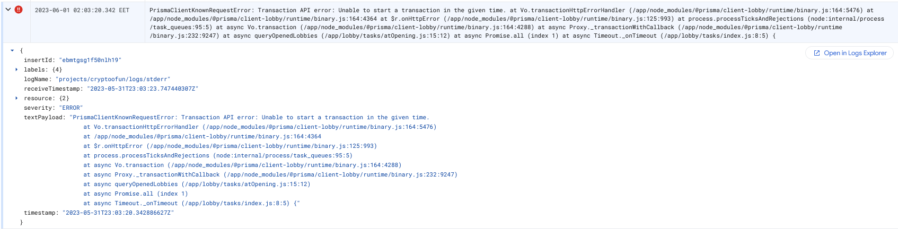
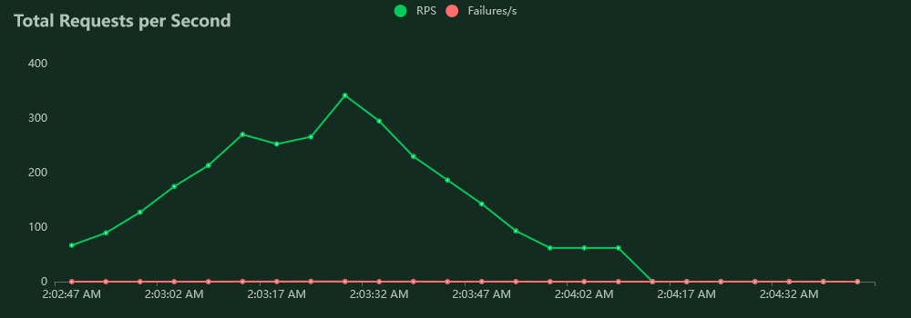
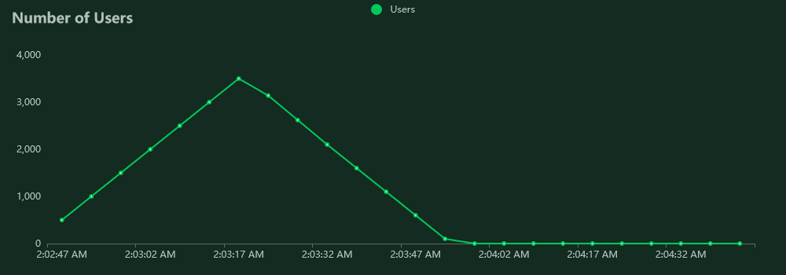

# Setup

### Kubernetes Cluster:

- **Platform:** GCP - Google Kubernetes Engine
- **Version:** 1.25.8-gke.500
- **Configuration:** n1-standard-2 x 3 nodes = 6 vCPUs + 22.5 GB memory
- **Location:** europe-west4

### Locust:

- **Worker Replicas:** 5

### Lobby Service

- **Replicas**: 3
- **Version:** pre-release/7

### Data Platforms

- **CockroachDB Cluster:** [Cloud Serverless](https://www.cockroachlabs.com/serverless/) Free Tier

  - Location: GCP - europe-west1

- **Redis Cluster:** Self-hosted within the same K8S cluster (1 master + 3 replicas via Helm)
  > ℹ Redis does not have a significant impact on this test case!

---

## Discussion

Lobby Service has been able to hit only up to ~350 RPS with 3 instances. The unexpected spike of high response times (ms) happened after [Prisma](https://prisma.io) ended up with multiple transaction errors like that:

We suspect that either Prisma's engine is unable to handle too many open transactions under heavy load ([see a similar issue while benchmarking](https://github.com/prisma/prisma/issues/10218)) or the serverless CockroachDB cluster is incapable for high load and causes transaction timeouts.

However, the aforementioned transaction issues were not directly related with the search endpoint, therefore no HTTP GET query failed for end users.

### Possible Solutions

- Switch to another ORM (and/or write raw SQL queries) as an alternative to Prisma
- Upgrade to a better CockroachDB cluster
- Add more machines/nodes

## Screenshots

_1685574305.png>)
