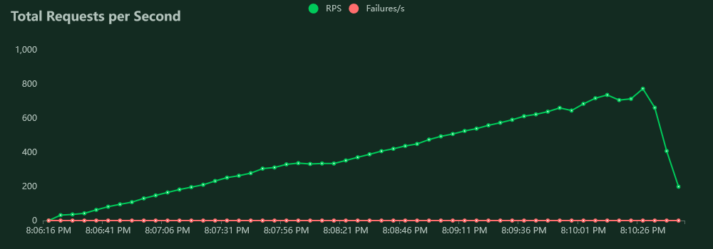

# Setup

### Kubernetes Cluster:

- **Platform:** GCP - Google Kubernetes Engine
- **Version:** 1.25.8-gke.500
- **Configuration:** e2-standard-2 x 3 nodes = 6 vCPUs + 24 GB memory
- **Location:** europe-west4

### Locust:

- **Worker Replicas:** 5

### Trade Butler

- **Replicas**: 3
- **Version:** pre-release/5 + Spring Reactive Cassandra support + Kafka Publisher improvements with asynchronous handling

### Data Platforms

- **Kafka Cluster:** [Instaclustr](https://www.instaclustr.com/support-solutions/kafka-support/) Free Tier

  - Topics: Partitions = 3, Replication Factor = 3
  - n1-standard-1 x 3 nodes = 3 vCPUs + 11.25 GB memory
  - Location: europe-west4

- **Cassandra Cluster:** [DataStax AstraDB Serverless](https://www.datastax.com/products/datastax-astra) Free Tier
  - Location: GCP - europe-west1

---

### Discussion

- Observed that the current Cassandra cluster in use (DataStax AstraDB Serverless) causes bottleneck after hitting 750 RPS:

> It was suspected that the previous Kafka Cluster (Conduktor.io Enterprise Trial edition) could be a bottleneck, therefore switched to a dedicated Kafka Cluster from another provider for the current load test.

- Java Virtual Machine needs more tweak for better performance profile, however could be related to Cassandra I/O issues:

### Possible Solutions

- Upgrade to better Cassandra Cluster
- Add more machines/nodes
- Java Profiling

## Screenshots

_1685380326.png>)
